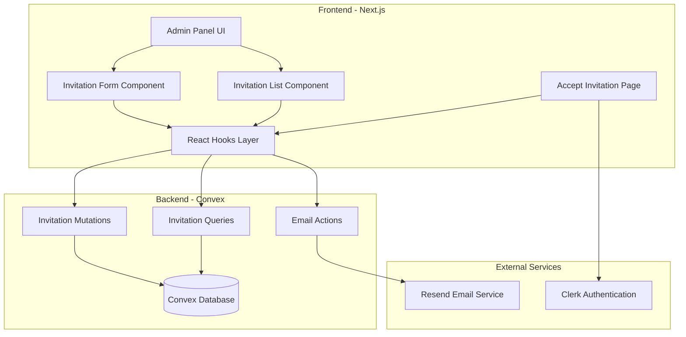

# Design Document: Admin Invitation System

## Overview

The Admin Invitation System provides a secure, token-based mechanism for authorized administrators to invite new users to the admin panel. The system integrates with the existing Convex backend, Clerk authentication, and Resend email service to deliver a seamless invitation workflow.

The design follows a three-phase flow:
1. **Invitation Creation** - Admin creates invitation, system generates token and sends email
2. **Email Delivery** - User receives branded email with secure invitation link
3. **Invitation Acceptance** - User clicks link, validates token, and creates account

The system leverages existing infrastructure including the Convex database schema (invitations and adminUsers tables), the Resend email integration, and React hooks for state management.

## Architecture

### System Components



### Data Flow

**Invitation Creation Flow:**
1. Admin submits invitation form (email + role)
2. Frontend validates input and calls `useInvitationMutations().create()`
3. Convex mutation generates secure token, stores invitation record
4. Convex action sends email via Resend with invitation link
5. Frontend displays success/error message and refreshes invitation list

**Invitation Acceptance Flow:**
1. User clicks invitation link with token parameter
2. Accept page loads and validates token via `useInvitationByToken(token)`
3. User enters name and password
4. Frontend calls `useAcceptInvitation().accept()` with token and user data
5. Convex mutation validates token, creates admin user, updates invitation status
6. User is redirected to login page

**Invitation Management Flow:**
1. Admin views invitation list via `useInvitations()`
2. Admin can resend (generates new token) or revoke (marks as revoked)
3. System automatically marks expired invitations based on expiresAt timestamp

## Components and Interfaces

### Frontend Components

#### InvitationManagement Component
Main container component for invitation management interface.

**Location:** `components/admin/management/invitation-management.tsx`

**Props:** None (uses hooks for data)

**State:**
- `showCreateDialog: boolean` - Controls create invitation modal visibility
- `selectedInvitation: Invitation | null` - Currently selected invitation for actions

**Key Methods:**
- `handleCreate(email, role)` - Creates new invitation
- `handleResend(invitationId)` - Resends invitation with new token
- `handleRevoke(invitationId)` - Revokes pending invitation
- `handleDelete(invitationId)` - Deletes invitation record

#### CreateInvitationDialog Component
Modal dialog for creating new invitations.

**Props:**
- `open: boolean` - Dialog visibility state
- `onOpenChange: (open: boolean) => void` - Callback for dialog state changes
- `onSubmit: (email: string, role: string) => Promise<void>` - Invitation creation handler

**Validation:**
- Email format validation (RFC 5322 compliant)
- Role selection required
- Duplicate email check before submission

#### InvitationTable Component
Table displaying all invitations with status, actions, and filtering.

**Props:**
- `invitations: Invitation[]` - Array of invitation records
- `onResend: (id: Id<"invitations">) => void` - Resend callback
- `onRevoke: (id: Id<"invitations">) => void` - Revoke callback
- `onDelete: (id: Id<"invitations">) => void` - Delete callback

**Features:**
- Status-based color coding (pending: yellow, accepted: green, expired: gray, revoked: red)
- Sortable columns (email, role, status, created date, expires date)
- Action buttons (resend, revoke) based on invitation status
- Responsive design matching existing admin tables

#### AcceptInvitationPage Component
Public page for accepting invitations.

**Location:** `app/accept-invite/page.tsx`

**URL Parameters:**
- `token: string` - Invitation token from email link

**State:**
- `name: string` - User's full name
- `password: string` - User's chosen password
- `confirmPassword: string` - Password confirmation
- `isSubmitting: boolean` - Form submission state

**Validation:**
- Token validity check on page load
- Name required (min 2 characters)
- Password strength requirements (min 8 characters, uppercase, lowercase, number)
- Password confirmation match

### Backend API (Convex)

#### Invitation Mutations

**File:** `convex/invitations.ts`

**create**
```typescript
Args: {
  email: string
  role: "super_admin" | "admin" | "viewer"
  invitedBy: string
  invitedByName: string
}
Returns: {
  id: Id<"invitations">
  token: string
  expiresAt: number
}
```
- Validates email format
- Checks for duplicate pending invitations
- Checks for existing admin user with email
- Generates cryptographically secure token (32 bytes, hex encoded)
- Sets expiration to 7 days from creation
- Stores invitation record with status "pending"

**accept**
```typescript
Args: {
  token: string
  name: string
  password: string
}
Returns: {
  userId: Id<"adminUsers">
  success: boolean
}
```
- Validates token exists and is pending
- Checks invitation not expired
- Hashes password using bcrypt (10 rounds)
- Creates admin user with specified role
- Updates invitation status to "accepted"
- Records acceptedAt timestamp

**resend**
```typescript
Args: {
  id: Id<"invitations">
}
Returns: {
  token: string
  expiresAt: number
}
```
- Validates invitation exists and is pending
- Generates new token
- Updates expiration to 7 days from now
- Returns new token for email sending

**revoke**
```typescript
Args: {
  id: Id<"invitations">
}
Returns: {
  success: boolean
}
```
- Updates invitation status to "revoked"
- Records revocation timestamp

**remove**
```typescript
Args: {
  id: Id<"invitations">
}
Returns: {
  success: boolean
}
```
- Deletes invitation record from database
- Only allowed for non-pending invitations

#### Invitation Queries

**list**
```typescript
Args: {}
Returns: Invitation[]
```
- Returns all invitations ordered by createdAt descending
- Includes all fields from schema

**stats**
```typescript
Args: {}
Returns: {
  total: number
  pending: number
  accepted: number
  expired: number
  revoked: number
}
```
- Aggregates invitation counts by status
- Checks expiration dynamically for pending invitations

**getByToken**
```typescript
Args: {
  token: string
}
Returns: Invitation | null
```
- Looks up invitation by token using indexed query
- Returns null if not found
- Used for token validation during acceptance

**checkEmail**
```typescript
Args: {
  email: string
}
Returns: {
  hasPendingInvitation: boolean
  hasAdminUser: boolean
}
```
- Checks if pending invitation exists for email
- Checks if active admin user exists with email
- Used for duplicate prevention

#### Email Actions

**sendInvitationEmail**
```typescript
Args: {
  email: string
  token: string
  role: string
  invitedByName: string
}
Returns: {
  success: boolean
  messageId?: string
  error?: string
}
```
- Constructs invitation URL with token parameter
- Renders HTML and plain text email templates
- Sends email via Resend API
- Returns success status and message ID or error

### React Hooks

#### useInvitations
```typescript
Returns: {
  invitations: Invitation[]
  stats: InvitationStats
  isLoading: boolean
}
```
- Subscribes to invitation list query
- Subscribes to invitation stats query
- Provides real-time updates

#### useInvitationMutations
```typescript
Returns: {
  create: (data) => Promise<Result>
  revoke: (id) => Promise<void>
  resend: (id, email, role, invitedByName) => Promise<Result>
  delete: (id) => Promise<void>
}
```
- Wraps Convex mutations with error handling
- Automatically triggers email sending for create and resend
- Returns combined result with email status

#### useInvitationByToken
```typescript
Args: {
  token: string | null
}
Returns: {
  invitation: Invitation | null
  isLoading: boolean
  isValid: boolean
  isExpired: boolean
}
```
- Queries invitation by token
- Computes validity based on status and expiration
- Used by accept invitation page

#### useAcceptInvitation
```typescript
Returns: {
  accept: (data) => Promise<Result>
}
```
- Wraps accept mutation
- Handles password hashing on backend
- Returns success status and user ID

## Data Models

### Invitation Schema

```typescript
{
  _id: Id<"invitations">
  email: string
  token: string
  role: "super_admin" | "admin" | "viewer"
  invitedBy: string
  invitedByName: string
  status: "pending" | "accepted" | "expired" | "revoked"
  expiresAt: number
  acceptedAt?: number
  createdAt: number
}
```

**Indexes:**
- `by_email` - For duplicate checking
- `by_token` - For token lookup during acceptance
- `by_status` - For filtering by status

**Constraints:**
- `email` must be valid email format
- `token` must be unique (64 character hex string)
- `expiresAt` must be 7 days after `createdAt`
- `acceptedAt` only set when status is "accepted"

### AdminUser Schema (Existing)

```typescript
{
  _id: Id<"adminUsers">
  email: string
  password: string
  name: string
  role: "super_admin" | "admin" | "viewer"
  isActive: boolean
  createdAt: number
  updatedAt: number
}
```

**Indexes:**
- `by_email` - For email uniqueness and lookup

### Token Generation

Tokens are generated using Node.js `crypto.randomBytes(32).toString('hex')` which produces:
- 32 bytes of cryptographically secure random data
- Encoded as 64 character hexadecimal string
- Collision probability: ~1 in 2^256 (effectively impossible)

## Correctness Properties

*A property is a characteristic or behavior that should hold true across all valid executions of a system—essentially, a formal statement about what the system should do. Properties serve as the bridge between human-readable specifications and machine-verifiable correctness guarantees.*


### Property 1: Token Uniqueness
*For any* two invitations created by the system, their invitation tokens should be different.
**Validates: Requirements 1.1, 7.2**

### Property 2: Email Validation
*For any* invitation creation attempt, if the email address is invalid (not RFC 5322 compliant), the system should reject the creation and return an error.
**Validates: Requirements 1.2**

### Property 3: Role Validation
*For any* invitation creation attempt, if the role is not one of "super_admin", "admin", or "viewer", the system should reject the creation and return an error.
**Validates: Requirements 1.2, 1.6**

### Property 4: Expiration Calculation
*For any* created invitation, the expiration timestamp (expiresAt) should equal the creation timestamp (createdAt) plus exactly 7 days (604,800,000 milliseconds).
**Validates: Requirements 1.3**

### Property 5: Inviter Information Persistence
*For any* invitation, after creation, querying the invitation should return the same inviter ID and inviter name that were provided during creation.
**Validates: Requirements 1.4**

### Property 6: Email Trigger on Creation
*For any* successful invitation creation, the email service action should be called with the correct recipient email, token, role, and inviter name.
**Validates: Requirements 1.5, 2.1**

### Property 7: Email Content Completeness
*For any* invitation email generated, the email body should contain the invitation token in a URL, the inviter's name, the assigned role, and the expiration timeframe.
**Validates: Requirements 2.2, 2.3, 2.4**

### Property 8: Email Format Duality
*For any* invitation email generated, both HTML and plain text versions should be created and sent.
**Validates: Requirements 9.3**

### Property 9: Email Error Handling
*For any* invitation creation where the email service fails, the system should return an error result indicating the email failure.
**Validates: Requirements 2.5**

### Property 10: Token Validation Rejects Invalid Tokens
*For any* token that does not exist in the invitations table, the validation should fail and return null or an error.
**Validates: Requirements 3.1**

### Property 11: Status Validation for Acceptance
*For any* invitation with status other than "pending", attempting to accept it should fail with an appropriate error message.
**Validates: Requirements 3.2**

### Property 12: Expiration Validation
*For any* invitation where the current timestamp exceeds the expiresAt timestamp, attempting to accept it should fail with an expiration error message.
**Validates: Requirements 3.3, 10.2, 10.4**

### Property 13: User Creation on Acceptance
*For any* valid invitation acceptance, a new admin user should be created with the email, name, password (hashed), and role from the invitation.
**Validates: Requirements 3.4**

### Property 14: Invitation Status Transition
*For any* accepted invitation, the invitation status should be updated to "accepted" and the acceptedAt timestamp should be set to the acceptance time.
**Validates: Requirements 3.5**

### Property 15: Acceptance Input Validation
*For any* invitation acceptance attempt, if name or password is missing or invalid, the system should reject the acceptance and return an error.
**Validates: Requirements 3.7**

### Property 16: Invitation List Completeness
*For any* query to list invitations, all invitations in the database should be returned with all required fields (status, email, role, inviter, expiration date).
**Validates: Requirements 4.1**

### Property 17: Statistics Accuracy
*For any* invitations stats query, the counts for total, pending, accepted, expired, and revoked should match the actual count of invitations with each status.
**Validates: Requirements 4.2**

### Property 18: Resend Token Regeneration
*For any* invitation resend operation, a new token should be generated that is different from the original token, and the expiration should be updated to 7 days from the resend time.
**Validates: Requirements 4.4**

### Property 19: Revocation Prevents Acceptance
*For any* invitation that has been revoked, attempting to accept it should fail with an error indicating the invitation is no longer valid.
**Validates: Requirements 4.5, 7.4**

### Property 20: Duplicate Pending Invitation Prevention
*For any* email address with an existing pending invitation, attempting to create a new invitation for that email should fail with a duplicate error.
**Validates: Requirements 5.1, 5.2**

### Property 21: Non-Pending Invitations Allow New Creation
*For any* email address where all existing invitations have status "accepted", "expired", or "revoked", creating a new invitation for that email should succeed.
**Validates: Requirements 5.3, 5.4**

### Property 22: Existing User Prevention
*For any* email address that belongs to an existing active admin user, attempting to create an invitation for that email should fail with an error.
**Validates: Requirements 5.5, 5.6**

### Property 23: Super Admin Role Permissions
*For any* invitation creation by a super_admin user, invitations with any role (super_admin, admin, or viewer) should be allowed.
**Validates: Requirements 6.1**

### Property 24: Admin Role Restrictions
*For any* invitation creation by an admin user, invitations with role "super_admin" should be rejected, while "admin" and "viewer" should be allowed.
**Validates: Requirements 6.2, 6.3, 6.5**

### Property 25: Token Entropy
*For any* generated invitation token, it should be a 64-character hexadecimal string (representing 32 bytes of random data).
**Validates: Requirements 7.1**

### Property 26: Accepted Token Reuse Prevention
*For any* invitation that has been accepted, attempting to accept it again with the same token should fail with an error.
**Validates: Requirements 7.3**

### Property 27: Email URL Construction
*For any* invitation email generated, the invitation URL should start with the value of NEXT_PUBLIC_APP_URL environment variable.
**Validates: Requirements 9.5**

## Error Handling

### Error Categories

**Validation Errors:**
- Invalid email format
- Invalid role value
- Missing required fields (name, password)
- Password too weak (< 8 characters)

**Business Logic Errors:**
- Duplicate pending invitation
- Email belongs to existing admin user
- Insufficient permissions for role assignment
- Token not found
- Invitation expired
- Invitation already accepted
- Invitation revoked

**External Service Errors:**
- Email service failure (Resend API error)
- Database operation failure

### Error Response Format

All mutations and actions return errors in a consistent format:

```typescript
{
  success: false,
  error: string,
  code?: string
}
```

Error codes:
- `INVALID_EMAIL` - Email format validation failed
- `INVALID_ROLE` - Role value not in allowed set
- `DUPLICATE_INVITATION` - Pending invitation already exists
- `USER_EXISTS` - Admin user with email already exists
- `INSUFFICIENT_PERMISSIONS` - User lacks permission for operation
- `TOKEN_NOT_FOUND` - Invitation token does not exist
- `INVITATION_EXPIRED` - Invitation past expiration date
- `INVITATION_ACCEPTED` - Invitation already accepted
- `INVITATION_REVOKED` - Invitation has been revoked
- `EMAIL_FAILED` - Email service returned error
- `VALIDATION_ERROR` - Input validation failed

### Error Handling Strategy

**Frontend:**
- Display user-friendly error messages using toast notifications
- Provide specific guidance for fixable errors (e.g., "Email already invited")
- Log detailed errors to console for debugging
- Disable form submission during processing to prevent duplicate requests

**Backend:**
- Validate all inputs before database operations
- Use try-catch blocks around external service calls
- Return structured error objects with codes
- Log errors with context for monitoring

**Email Service:**
- Retry failed emails up to 3 times with exponential backoff
- Log all email attempts to emailLogs table
- Return detailed error messages from Resend API
- Continue invitation creation even if email fails (allow manual resend)

## Testing Strategy

### Dual Testing Approach

The testing strategy employs both unit tests and property-based tests to ensure comprehensive coverage:

**Unit Tests** focus on:
- Specific examples of invitation flows (create, accept, resend, revoke)
- Edge cases (expired invitations, invalid tokens, duplicate emails)
- Error conditions (missing fields, invalid formats, permission denials)
- Integration points (email service calls, database queries)

**Property-Based Tests** focus on:
- Universal properties that hold for all inputs (token uniqueness, expiration calculation)
- Comprehensive input coverage through randomization (email validation, role validation)
- Invariants that must be maintained (status transitions, duplicate prevention)

Together, unit tests catch concrete bugs in specific scenarios, while property tests verify general correctness across all possible inputs.

### Property-Based Testing Configuration

**Library:** fast-check (TypeScript/JavaScript property-based testing library)

**Configuration:**
- Minimum 100 iterations per property test
- Each property test references its design document property
- Tag format: `Feature: admin-invitation-system, Property {number}: {property_text}`

**Example Property Test Structure:**
```typescript
// Feature: admin-invitation-system, Property 1: Token Uniqueness
test('generated tokens are always unique', async () => {
  await fc.assert(
    fc.asyncProperty(
      fc.array(fc.record({ email: fc.emailAddress(), role: fc.constantFrom('admin', 'viewer') }), { minLength: 2, maxLength: 10 }),
      async (invitationData) => {
        const tokens = await Promise.all(
          invitationData.map(data => createInvitation(data))
        );
        const uniqueTokens = new Set(tokens.map(inv => inv.token));
        expect(uniqueTokens.size).toBe(tokens.length);
      }
    ),
    { numRuns: 100 }
  );
});
```

### Test Coverage Requirements

**Backend (Convex Functions):**
- All mutations: create, accept, resend, revoke, remove
- All queries: list, stats, getByToken, checkEmail
- Email action: sendInvitationEmail
- Token generation utility
- Password hashing utility

**Frontend (React Components):**
- InvitationManagement component (create, list, actions)
- CreateInvitationDialog component (validation, submission)
- InvitationTable component (display, sorting, actions)
- AcceptInvitationPage component (validation, acceptance)

**Hooks:**
- useInvitations (data fetching, real-time updates)
- useInvitationMutations (all mutation wrappers)
- useInvitationByToken (token validation)
- useAcceptInvitation (acceptance flow)

### Integration Testing

**Email Integration:**
- Mock Resend API for testing email sending
- Verify email content includes all required elements
- Test email failure handling and error reporting

**Database Integration:**
- Test all Convex queries and mutations
- Verify indexes are used correctly
- Test concurrent invitation creation (race conditions)

**Authentication Integration:**
- Test role-based permission checking
- Verify admin user creation on acceptance
- Test Clerk integration for new user accounts

### Manual Testing Checklist

- [ ] Create invitation as super admin for all role types
- [ ] Create invitation as admin (verify super_admin blocked)
- [ ] Attempt to create duplicate invitation (verify blocked)
- [ ] Accept invitation and verify account created
- [ ] Attempt to accept expired invitation (verify blocked)
- [ ] Resend invitation and verify new token works
- [ ] Revoke invitation and verify cannot be accepted
- [ ] Verify email received with correct content
- [ ] Test invitation link in email works correctly
- [ ] Verify invitation list shows correct statuses and counts
